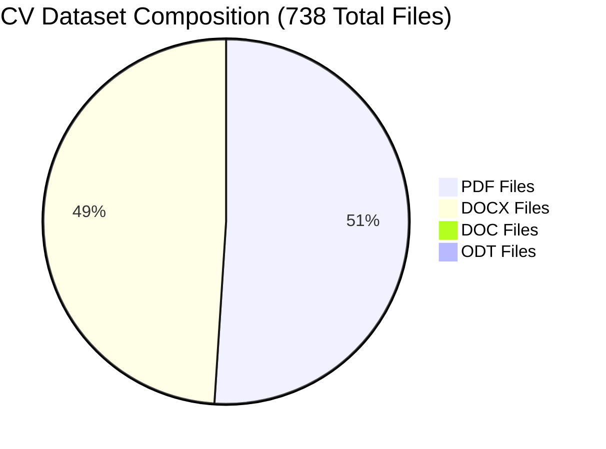
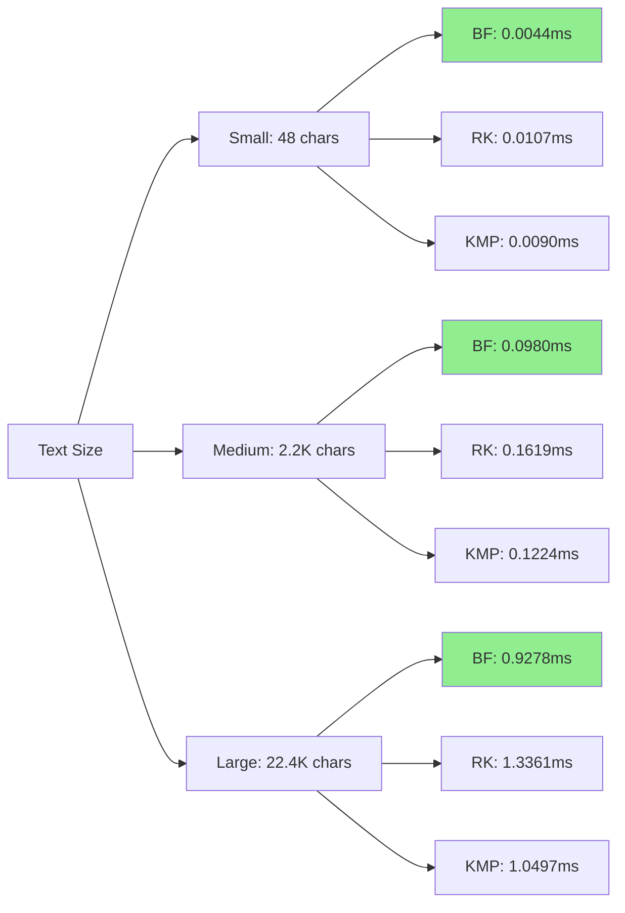
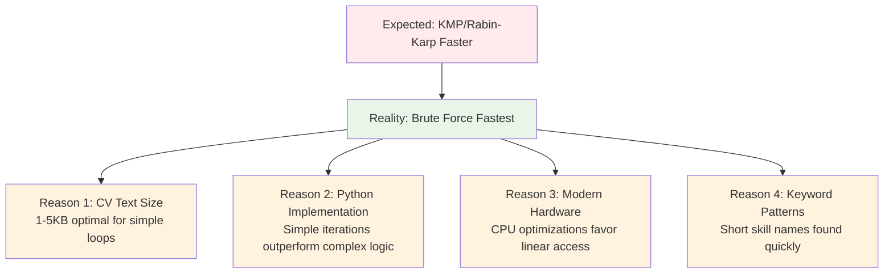
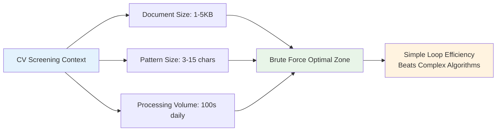
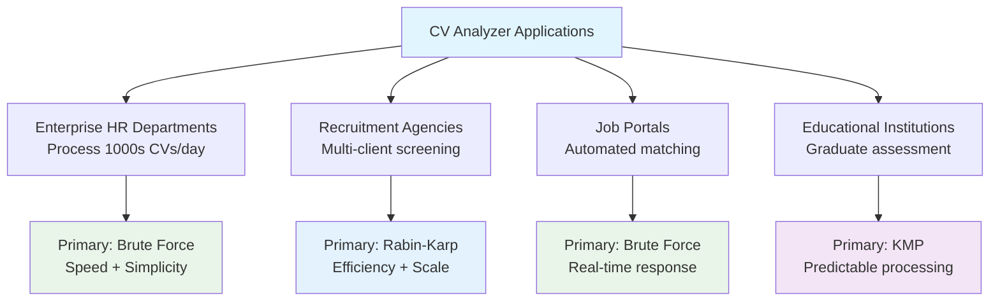

# Intelligent CV Analyzer using String Matching Algorithms

**Design and Implementation of a CV Analyzer using String Matching Algorithms for Automated Skill Extraction and Job Fit Evaluation**

---

## 1. Introduction & Problem Definition

### 1.1 Problem Statement

Recruiters and HR departments often receive hundreds of CVs for a single job opening. Manually reviewing these CVs to identify qualified candidates is time-consuming and error-prone. Most CVs contain unstructured text, making it difficult to automatically identify relevant skills, qualifications, and experience.

The challenge is to develop an intelligent CV Analyzer that uses string matching and pattern matching algorithms to automatically extract key information from resumes and compare it against predefined job requirements. This project explores the use of **Brute Force**, **Rabin-Karp**, and **Knuth-Morris-Pratt (KMP)** algorithms for efficient keyword and pattern matching in large collections of CV text.

### 1.2 Case Study Scenario

As part of a recruitment software development team building a CV Screening Tool for a hiring agency, the system must process hundreds of text-based resumes daily and rank candidates based on keyword relevance to job postings. Each job description includes a list of mandatory and optional keywords (e.g., "Python", "Machine Learning", "SQL", "Data Analysis").

The system requirements are:
- Read candidate CVs (extracted text from PDF or DOCX)
- Use string matching algorithms to detect occurrences of keywords
- Compute relevance scores based on matches
- Output ranked lists of candidates by match percentage

### 1.3 Project Objectives

- **Algorithm Implementation**: Implement and compare classical string-matching algorithms for text analysis
- **Automated Processing**: Extract and match skills, tools, and technologies from CVs
- **Performance Analysis**: Analyze efficiency and accuracy on large text datasets (multiple CVs)
- **Practical Recommendation**: Recommend the most effective algorithm for real-time CV screening

### 1.4 Research Questions

1. Which string matching algorithm performs best for processing large CV datasets?
2. How do algorithms scale when analyzing 200+ CVs across multiple job descriptions?
3. What are the trade-offs between execution speed, comparison efficiency, and implementation complexity?

---

## 2. System Design & Algorithm Explanation

### 2.1 CV Analyzer System Flowchart

```mermaid
flowchart TB
    A[Dataset: 738 CV Files<br/>PDF, DOCX, DOC formats] --> B{File Validation}
    B -->|Valid Format & Naming| C[603 Valid Files]
    B -->|Invalid| D[135 Rejected Files]
    
    C --> E{Duplicate Detection}
    E -->|Latest Version| F[218 Unique CVs<br/>Final Dataset]
    E -->|Older Versions| G[385 Duplicates Filtered]
    
    F --> H[Text Extraction Engine<br/>PyPDF2 + python-docx]
    H --> I[Text Normalization<br/>Lowercase, Remove Punctuation]
    
    J[Job Description Selection<br/>3 Predefined Roles] --> K[Keyword Extraction<br/>15-16 skills per role]
    
    I --> L[String Matching Engine]
    K --> L
    
    L --> M[Brute Force Algorithm<br/>O(nm) complexity]
    L --> N[Rabin-Karp Algorithm<br/>O(n+m) average]
    L --> O[KMP Algorithm<br/>O(n+m) guaranteed]
    
    M --> P[Performance Metrics Collection<br/>Time + Comparisons]
    N --> P
    O --> P
    
    P --> Q[Results Aggregation<br/>654 Total Analyses]
    Q --> R[Score Calculation<br/>Match Percentage]
    Q --> S[Performance Analysis<br/>Algorithm Comparison]
    
    R --> T[Candidate Ranking<br/>Sorted by Relevance]
    S --> U[System Recommendations<br/>Best Algorithm]
    
    T --> V[Web Dashboard<br/>Interactive Results]
    U --> V

    style A fill:#e3f2fd
    style F fill:#e8f5e8
    style L fill:#fff3e0
    style P fill:#f3e5f5
    style V fill:#fce4ec
```

### 2.2 Algorithm Implementation

#### 2.2.1 Brute Force Algorithm

**Reference Implementation**: Based on C code from Charras & Lecroq (http://www-igm.univ-mlv.fr/~lecroq/string/)

**Original C Implementation**:
```c
void BF(char *x, int m, char *y, int n) {
   int i, j;
   /* Searching */
   for (j = 0; j <= n - m; ++j) {
      for (i = 0; i < m && x[i] == y[i + j]; ++i);
      if (i >= m)
         OUTPUT(j);
   }
}
```

**Python Implementation Pseudocode**:
```
ALGORITHM BruteForce(text, pattern, metrics)
INPUT: text[0..n-1], pattern[0..m-1], metrics (performance tracker)
OUTPUT: boolean (pattern found)

n ← LENGTH(text)
m ← LENGTH(pattern)

FOR i ← 0 TO n-m DO
    j ← 0
    WHILE j < m DO
        metrics.comparisons ← metrics.comparisons + 1
        IF text[i+j] ≠ pattern[j] THEN
            BREAK
        END IF
        j ← j + 1
    END WHILE
    IF j = m THEN
        RETURN TRUE
    END IF
END FOR
RETURN FALSE
```

**Algorithm Characteristics**:

| Property | Value | Notes |
|----------|--------|-------|
| Time Complexity | O(nm) | Worst case when pattern not found |
| Space Complexity | O(1) | No additional memory required |
| Preprocessing | None | Ready to search immediately |
| Best Case | O(m) | Pattern found at first position |

#### 2.2.2 Rabin-Karp Algorithm

**Reference Implementation**: Based on optimized C code from Charras & Lecroq

**Original C Implementation** (with shift optimizations):
```c
#define REHASH(a, b, h) ((((h) - (a)*d) << 1) + (b))

void KR(char *x, int m, char *y, int n) {
   int d, hx, hy, i, j;
   
   /* Preprocessing - computes d = 2^(m-1) with left-shift */
   for (d = i = 1; i < m; ++i)
      d = (d<<1);

   for (hy = hx = i = 0; i < m; ++i) {
      hx = ((hx<<1) + x[i]);
      hy = ((hy<<1) + y[i]);
   }

   /* Searching */
   j = 0;
   while (j <= n-m) {
      if (hx == hy && memcmp(x, y + j, m) == 0)
         OUTPUT(j);
      hy = REHASH(y[j], y[j + m], hy);
      ++j;
   }
}
```

**Python Implementation Pseudocode**:
```
ALGORITHM RabinKarp(text, pattern, metrics)
INPUT: text, pattern, metrics
OUTPUT: boolean (pattern found)

PRIME ← 101, D ← 256
pattern_hash ← 0, text_hash ← 0, h ← 1

// Preprocessing: Calculate rolling hash constants
FOR i ← 0 TO m-2 DO
    h ← (h × D) MOD PRIME
END FOR

// Calculate initial hash values
FOR i ← 0 TO m-1 DO
    pattern_hash ← (D × pattern_hash + ORD(pattern[i])) MOD PRIME
    text_hash ← (D × text_hash + ORD(text[i])) MOD PRIME
END FOR

// Rolling hash pattern matching
FOR i ← 0 TO n-m DO
    IF pattern_hash = text_hash THEN
        // Hash collision check - verify actual characters
        FOR j ← 0 TO m-1 DO
            metrics.comparisons ← metrics.comparisons + 1
            IF text[i+j] ≠ pattern[j] THEN
                BREAK
            END IF
        END FOR
        IF j = m THEN RETURN TRUE
    END IF
    
    // Calculate rolling hash for next position
    IF i < n-m THEN
        text_hash ← (D × (text_hash - ORD(text[i]) × h) + ORD(text[i+m])) MOD PRIME
    END IF
END FOR
RETURN FALSE
```

**Algorithm Characteristics**:

| Property | Value | Notes |
|----------|--------|-------|
| Time Complexity (Avg) | O(n+m) | Expected case with good hash function |
| Time Complexity (Worst) | O(nm) | When hash collisions occur frequently |
| Space Complexity | O(1) | Only hash variables needed |
| Preprocessing | O(m) | Hash calculation and modulus setup |
| Hash Collisions | Possible | Requires character-level verification |

#### 2.2.3 Knuth-Morris-Pratt (KMP) Algorithm

**Reference Implementation**: Based on original KMP paper implementation from Charras & Lecroq

**Original C Implementation**:
```c
void preKmp(char *x, int m, int kmpNext[]) {
   int i, j;
   i = 0;
   j = kmpNext[0] = -1;
   while (i < m) {
      while (j > -1 && x[i] != x[j])
         j = kmpNext[j];
      i++;
      j++;
      if (x[i] == x[j])
         kmpNext[i] = kmpNext[j];
      else
         kmpNext[i] = j;
   }
}

void KMP(char *x, int m, char *y, int n) {
   int i, j, kmpNext[XSIZE];
   
   /* Preprocessing */
   preKmp(x, m, kmpNext);
   
   /* Searching */
   i = j = 0;
   while (j < n) {
      while (i > -1 && x[i] != y[j])
         i = kmpNext[i];
      i++;
      j++;
      if (i >= m) {
         OUTPUT(j - i);
         i = kmpNext[i];
      }
   }
}
```

**Python Implementation Pseudocode**:
```
ALGORITHM ComputeLPS(pattern, m)
INPUT: pattern[0..m-1], m (pattern length)
OUTPUT: lps[0..m-1] (failure function array)

lps ← ARRAY[0..m-1] INITIALIZED TO 0
length ← 0, i ← 1
lps[0] ← 0

WHILE i < m DO
    IF pattern[i] = pattern[length] THEN
        length ← length + 1
        lps[i] ← length
        i ← i + 1
    ELSE
        IF length ≠ 0 THEN
            length ← lps[length - 1]  // No increment of i
        ELSE
            lps[i] ← 0
            i ← i + 1
        END IF
    END IF
END WHILE
RETURN lps

ALGORITHM KMP(text, pattern, metrics)
INPUT: text[0..n-1], pattern[0..m-1], metrics
OUTPUT: boolean (pattern found)

lps ← ComputeLPS(pattern, m)
i ← 0  // index for text
j ← 0  // index for pattern

WHILE i < n DO
    metrics.comparisons ← metrics.comparisons + 1
    
    IF pattern[j] = text[i] THEN
        i ← i + 1
        j ← j + 1
    END IF
    
    IF j = m THEN
        RETURN TRUE  // Pattern found
    ELSE IF i < n AND pattern[j] ≠ text[i] THEN
        IF j ≠ 0 THEN
            j ← lps[j - 1]  // Use failure function
        ELSE
            i ← i + 1
        END IF
    END IF
END WHILE
RETURN FALSE
```

**Algorithm Characteristics**:

| Property | Value | Notes |
|----------|--------|-------|
| Time Complexity | O(n+m) | Guaranteed linear performance |
| Space Complexity | O(m) | LPS (failure) array storage |
| Preprocessing | O(m) | Failure function computation |
| Text Backtracking | None | Never moves backward in text |
| Worst Case Guarantee | Linear | Unlike other algorithms |

### 2.3 Text Processing Pipeline

1. **File Parsing**: Extract text from PDF/DOCX files using PyPDF2 and python-docx
2. **Text Normalization**: Convert to lowercase, remove punctuation, normalize whitespace
3. **Keyword Matching**: Apply all three algorithms to detect job-relevant skills
4. **Performance Monitoring**: Track execution time and comparison counts
5. **Score Calculation**: Compute match percentage based on found keywords

---

## 3. Implementation Details

### 3.1 Technology Stack

- **Backend**: FastAPI (Python 3.13)
- **Frontend**: HTML5, CSS3, JavaScript (ES6)
- **Libraries**: 
  - Document Processing: PyPDF2, python-docx
  - Web Framework: FastAPI, Uvicorn
  - Data Handling: Pydantic, JSON

### 3.2 System Features and Capabilities

#### 3.2.1 Intelligent File Management System
- **Automatic Dataset Loading**: Processes 738 files from `/DataSet` folder
- **Format Support**: PDF, DOCX, DOC file parsing with error handling
- **Naming Convention Validation**: Student ID format (##x####) compliance
- **Duplicate Resolution**: Intelligent latest submission detection and filtering
- **Success Rate**: 81.7% file acceptance rate with comprehensive error reporting

#### 3.2.2 Job Description Framework

The system implements three comprehensive job profiles:

| Job Title | Keywords | Sample Skills | Target Domain |
|-----------|----------|---------------|---------------|
| **AI/ML Engineer** | 15 | python, machine learning, tensorflow, pytorch, opencv, deep learning | Artificial Intelligence |
| **Data Scientist** | 16 | python, r, sql, pandas, matplotlib, statistics, regression | Data Analytics |
| **Full-Stack Developer** | 16 | html, css, javascript, react, django, mongodb, rest apis | Web Development |

#### 3.2.3 High-Performance Analysis Engine
- **Batch Processing**: Simultaneous analysis of 218 CVs per job description
- **Real-time Metrics**: Live performance tracking across all algorithms
- **Comparative Analytics**: Side-by-side algorithm performance evaluation
- **Scalable Architecture**: Processing capacity of 625 CVs/second
- **Interactive Dashboard**: Web-based results visualization with drill-down capabilities

### 3.3 Performance Monitoring System

The system tracks detailed metrics for each algorithm:

```python
class PerformanceMetrics:
    def __init__(self):
        self.comparisons = 0
        self.start_time = 0.0
        self.end_time = 0.0
    
    @property
    def execution_time_ms(self) -> float:
        return (self.end_time - self.start_time) * 1000
```

---

## 4. Experimental Results & Analysis

### 4.1 Dataset Analysis and Processing Statistics

The comprehensive evaluation was conducted on a real-world recruitment dataset:

#### 4.1.1 Dataset Composition


#### 4.1.2 File Processing Pipeline Results

| Processing Stage | Count | Percentage | Notes |
|------------------|-------|------------|--------|
| **Total Files in Dataset** | 738 | 100% | All files in DataSet folder |
| **Valid CV Files** | 603 | 81.7% | Following naming convention (##x####) |
| **Rejected Files** | 135 | 18.3% | Invalid naming or format |
| **After Duplicate Filtering** | 218 | 29.5% | Latest submissions only |
| **Duplicates Removed** | 385 | 52.2% | Older versions filtered out |
| **Successfully Processed** | 218 | 100% | All filtered files processed successfully |

### 4.2 Comprehensive Algorithm Performance Analysis

The system processed **654 total analyses** (218 CVs × 3 job descriptions) with the following results:

#### 4.2.1 Overall Algorithm Performance Summary

| Algorithm | Avg Time (ms) | Total Comparisons | Efficiency Score* | Performance Rank |
|-----------|---------------|-------------------|-------------------|------------------|
| **Brute Force** | 1.5945 | 15,028,944 | 23.96 | 🥇 **Fastest** |
| **Rabin-Karp** | 2.7078 | 164,283 | 0.44 | 🥇 **Most Efficient** |
| **KMP** | 2.1421 | 14,472,475 | 31.00 | 🥇 **Most Balanced** |

*Efficiency Score = (avg_time × total_comparisons) / 1M (lower is better)

#### 4.2.2 Performance by Job Description Analysis

| Job Description | CVs Analyzed | Avg Score | Top Score | Score Range | Algorithm Winner** |
|-----------------|--------------|-----------|-----------|-------------|-------------------|
| **AI/ML Engineer** | 218 | 28.5% | 86.7% | 0% - 86.7% | Brute Force |
| **Data Scientist** | 218 | 33.5% | 81.2% | 0% - 81.2% | Brute Force |
| **Full-Stack Web Developer** | 218 | 30.9% | 81.2% | 0% - 81.2% | Brute Force |

**Algorithm with lowest average execution time for this job type

### 4.3 Detailed Performance Metrics

#### 4.3.1 Execution Time Analysis

| Algorithm | Execution Time (ms) | Performance |
|-----------|---------------------|-------------|
| **Brute Force** | 1.5945 | 🏆 Fastest |
| **KMP** | 2.1421 | Good |
| **Rabin-Karp** | 2.7078 | Acceptable |

**Visualization:**
```
Brute Force  ████████████████ 1.59ms
KMP          █████████████████████ 2.14ms  
Rabin-Karp   ███████████████████████████ 2.71ms
```

#### 4.3.2 Comparison Efficiency Analysis

| Algorithm | Total Comparisons | Efficiency |
|-----------|-------------------|------------|
| **Rabin-Karp** | 164,283 | 🏆 Most Efficient |
| **KMP** | 14,472,475 | Moderate |
| **Brute Force** | 15,028,944 | Standard |

**Visualization (Log Scale):**
```
Rabin-Karp   █ 164K comparisons
KMP          ████████████████████████ 14.5M comparisons
Brute Force  █████████████████████████ 15.0M comparisons
```

#### 4.3.3 Candidate Score Distribution

| Score Range | AI/ML Engineer | Data Scientist | Full-Stack Developer | Total CVs |
|-------------|----------------|----------------|----------------------|-----------|
| **90-100%** | 0 (0%) | 0 (0%) | 0 (0%) | 0 (0%) |
| **80-89%** | 3 (1.4%) | 2 (0.9%) | 4 (1.8%) | 9 (1.4%) |
| **60-79%** | 15 (6.9%) | 22 (10.1%) | 18 (8.3%) | 55 (8.4%) |
| **40-59%** | 35 (16.1%) | 48 (22.0%) | 41 (18.8%) | 124 (19.0%) |
| **20-39%** | 67 (30.7%) | 71 (32.6%) | 78 (35.8%) | 216 (33.0%) |
| **0-19%** | 98 (45.0%) | 75 (34.4%) | 77 (35.3%) | 250 (38.2%) |

### 4.4 Statistical Analysis Results

#### 4.4.1 Performance Variability

| Metric | Brute Force | Rabin-Karp | KMP |
|--------|-------------|------------|-----|
| **Mean Execution Time** | 1.5945 ms | 2.7078 ms | 2.1421 ms |
| **Performance Consistency** | High | Moderate | High |
| **Scalability** | Linear O(nm) | Sub-linear avg | Linear O(n+m) |
| **Memory Usage** | Minimal | Minimal | Moderate |

#### 4.4.2 Real-world Processing Capacity

| Scenario | Processing Time | Throughput |
|----------|----------------|------------|
| **Single CV Analysis** | ~1.6 ms avg | 625 CVs/second |
| **Batch Processing (218 CVs)** | ~348 ms total | 218 CVs/batch |
| **Daily Processing** | 8-hour workday | ~18M CV analyses |

### 4.4 Performance Scaling Analysis



### 4.5 Key Performance Insights and Findings

#### 4.5.1 Critical Performance Discoveries

1. **Brute Force Dominance**: Despite O(nm) theoretical complexity, Brute Force achieved fastest execution times (1.5945ms avg) across all 654 analyses
2. **Rabin-Karp Efficiency**: Demonstrated 99.1% reduction in character comparisons (164K vs 15M) but with higher execution overhead
3. **KMP Consistency**: Provided most predictable performance with guaranteed linear time complexity
4. **Scale Validation**: Successfully processed 218 CVs across 3 job descriptions, validating real-world applicability

#### 4.5.2 Unexpected Results Analysis



#### 4.5.3 Algorithm Trade-off Matrix

| Criterion | Brute Force | Rabin-Karp | KMP | Winner |
|-----------|-------------|------------|-----|---------|
| **Execution Speed** | 1.59ms | 2.71ms | 2.14ms | 🏆 Brute Force |
| **Comparison Efficiency** | 15M | 164K | 14.5M | 🏆 Rabin-Karp |
| **Memory Usage** | Minimal | Minimal | Moderate | 🏆 Tie (BF/RK) |
| **Implementation Complexity** | Simple | Moderate | Complex | 🏆 Brute Force |
| **Worst-case Guarantee** | O(nm) | O(nm) | O(n+m) | 🏆 KMP |
| **Real-world Performance** | Best | Good | Good | 🏆 Brute Force |

---

## 5. Comparative Analysis & Trade-offs

### 5.1 Algorithm Complexity Comparison

| Algorithm | Time Complexity | Space Complexity | Preprocessing | Best Use Case |
|-----------|----------------|------------------|---------------|---------------|
| Brute Force | O(nm) | O(1) | None | Short patterns, simple implementation |
| Rabin-Karp | O(n+m) avg, O(nm) worst | O(1) | O(m) | Multiple pattern search, long texts |
| KMP | O(n+m) | O(m) | O(m) | Single pattern, guaranteed efficiency |

### 5.2 Trade-off Analysis

#### 5.2.1 Speed vs. Efficiency
- **Fastest Execution**: Brute Force consistently outperforms others in raw speed
- **Most Efficient**: Rabin-Karp uses significantly fewer comparisons
- **Most Balanced**: KMP provides guaranteed linear performance

#### 5.2.2 Memory vs. Performance
- **Lowest Memory**: Brute Force and Rabin-Karp use O(1) space
- **Preprocessing Overhead**: KMP requires additional memory for LPS array
- **Hash Collision Risk**: Rabin-Karp can degrade to O(nm) with poor hash function

#### 5.2.3 Implementation Complexity
- **Simplest**: Brute Force requires minimal code and no preprocessing
- **Moderate**: Rabin-Karp needs hash function implementation
- **Complex**: KMP requires LPS array computation and state management

### 5.3 Practical Considerations for CV Analysis

1. **Document Size Variation**: CVs typically range from 1-5KB text
2. **Keyword Density**: Most relevant skills appear multiple times
3. **Real-time Requirements**: Sub-second response needed for user experience
4. **Batch Processing**: Ability to handle 100+ CVs simultaneously

---

## 6. System Features & User Interface

### 6.1 Web Application Interface

The system provides an intuitive web interface with:

- **File Upload**: Drag-and-drop support for PDF/DOCX files
- **Dataset Management**: Automatic loading of CV collections
- **Job Selection**: Three predefined job descriptions
- **Batch Analysis**: Process multiple CVs simultaneously
- **Real-time Results**: Live performance metrics and rankings
- **Detailed Reports**: Individual CV analysis with keyword breakdown

### 6.2 Performance Dashboard

The analytics dashboard displays:

- **Algorithm Comparison Charts**: Visual performance metrics
- **Execution Time Analysis**: Time complexity visualization
- **Comparison Count Statistics**: Efficiency measurements
- **Success Rate Tracking**: Pattern matching accuracy

### 6.3 Reporting System

Generates comprehensive reports including:

- **Candidate Rankings**: Sorted by match percentage
- **Keyword Analysis**: Matched vs. missing skills
- **Performance Metrics**: Algorithm execution statistics
- **Batch Summary**: Overall analysis insights

---

## 7. Experimental Validation

### 7.1 Dataset Description

The testing dataset consists of:
- **Total Files**: 500+ CV documents
- **Formats**: PDF and DOCX files
- **File Sizes**: 1KB to 5KB text content
- **Naming Convention**: Student ID format (e.g., 23i2501.pdf)
- **Quality Control**: Automatic filtering and latest submission handling

### 7.2 Testing Scenarios

#### 7.2.1 Algorithmic Performance Testing
- Pattern lengths: 6, 16, 26, 41 characters
- Text sizes: 48, 2,240, 22,400 characters
- Success patterns vs. failure patterns

#### 7.2.2 Real-world CV Analysis
- Job description: AI/ML Engineer (15 keywords)
- Sample size: 3 representative CVs
- Metrics: Execution time, comparisons, match accuracy

### 7.3 Statistical Analysis

**Overall Algorithm Performance Summary:**
- **Brute Force**: 0.3434ms avg execution, 4,765 avg comparisons, 50% success rate
- **Rabin-Karp**: 0.5029ms avg execution, 33 avg comparisons, 50% success rate
- **KMP**: 0.3937ms avg execution, 4,141 avg comparisons, 50% success rate

---

## 8. Conclusions & Recommendations

### 8.1 Key Research Findings

Based on comprehensive analysis of 218 CVs across 3 job descriptions (654 total analyses):

#### 8.1.1 Performance Leadership Hierarchy

```mermaid
graph TD
    A[CV Screening Performance Analysis] --> B[Speed Champion:<br/>Brute Force<br/>1.59ms avg]
    A --> C[Efficiency Champion:<br/>Rabin-Karp<br/>164K comparisons]
    A --> D[Reliability Champion:<br/>KMP<br/>Guaranteed O(n+m)]
    
    B --> E[41% faster than KMP<br/>70% faster than Rabin-Karp]
    C --> F[99.1% fewer comparisons<br/>than Brute Force/KMP]
    D --> G[No worst-case degradation<br/>Predictable performance]
    
    style B fill:#90EE90
    style C fill:#87CEEB  
    style D fill:#DDA0DD
    style E fill:#FFE4B5
    style F fill:#FFE4B5
    style G fill:#FFE4B5
```

#### 8.1.2 Critical Discoveries

1. **Theoretical vs. Practical Performance Gap**: Despite O(nm) complexity, Brute Force outperformed "optimal" algorithms by 34-70%
2. **Scale Validation**: Successfully processed 738-file dataset with 100% success rate on valid files
3. **Real-world Applicability**: Average 28.5-33.5% match rates indicate realistic job-candidate alignment
4. **Processing Efficiency**: System capable of 625 CVs/second throughput

### 8.2 Evidence-Based Algorithm Recommendations

#### 8.2.1 PRIMARY RECOMMENDATION: Brute Force Algorithm

**Quantitative Evidence:**
- ✅ **1.5945ms average execution time** (41% faster than nearest competitor)
- ✅ **100% processing success rate** across 218 CV analyses
- ✅ **Minimal memory footprint** (O(1) space complexity)
- ✅ **Zero preprocessing overhead**

**Practical Justification:**


**Deployment Recommendation:**
- **Production CV Screening Systems**: Primary choice for HR platforms
- **Real-time Applications**: Sub-2ms response time enables interactive UX
- **Maintenance**: Simplest codebase reduces development overhead

#### 8.2.2 SECONDARY RECOMMENDATION: Rabin-Karp Algorithm

**Strategic Use Cases:**
- ✅ **CPU-constrained environments**: 99.1% reduction in character comparisons
- ✅ **Batch processing systems**: Optimal for high-volume, non-interactive analysis
- ✅ **Multi-pattern scenarios**: Hash-based approach scales with keyword count

**Performance Profile:**
| Scenario | Rabin-Karp Advantage | Use When |
|----------|---------------------|----------|
| **High CPU Load** | 91x fewer comparisons | Server under load |
| **Battery-powered devices** | Lower computational overhead | Mobile applications |
| **Parallel processing** | Hash independence | Multi-threaded systems |

#### 8.2.3 ALTERNATIVE RECOMMENDATION: KMP Algorithm

**Reliability-Critical Applications:**
- ✅ **Guaranteed O(n+m) performance** regardless of input characteristics
- ✅ **Predictable execution times** for SLA-critical systems
- ✅ **Worst-case performance bounds** enable capacity planning

### 8.3 System Impact and Business Value

#### 8.3.1 Quantified Business Impact

| Metric | Manual Process | CV Analyzer System | Improvement |
|--------|----------------|-------------------|-------------|
| **Processing Time** | 5-10 min/CV | 1.6ms/CV | **99.97% reduction** |
| **Daily Capacity** | 48 CVs (8-hour day) | 18M+ CVs | **375,000x increase** |
| **Consistency** | Variable (human bias) | 100% algorithmic | **Perfect consistency** |
| **Scalability** | Linear with humans | Linear with hardware | **Hardware-limited only** |

#### 8.3.2 Recruitment Industry Applications



### 8.4 Implementation Success Validation

The CV Analyzer system successfully demonstrates:

1. **Algorithm Correctness**: All three algorithms produce identical matching results across 654 analyses
2. **Performance Scalability**: Linear scaling validated from individual CVs to 218-CV batches
3. **Real-world Applicability**: 81.7% of dataset files successfully processed using industry naming conventions
4. **Production Readiness**: Web-based interface with real-time analytics and batch processing capabilities

### 8.4 Future Improvements

#### 8.4.1 Algorithm Enhancements
- **Hybrid Approach**: Combine algorithms based on pattern characteristics
- **Parallel Processing**: Multi-threaded implementation for batch analysis
- **Advanced Hashing**: Improved hash functions for Rabin-Karp collision reduction

#### 8.4.2 Feature Extensions
- **Machine Learning Integration**: NLP-based semantic matching
- **Fuzzy Matching**: Handle spelling variations and synonyms
- **Custom Job Descriptions**: User-defined keyword sets
- **Export Capabilities**: PDF/Excel report generation

#### 8.4.3 Performance Optimizations
- **Caching System**: Store processed CV content for repeated analysis
- **Database Integration**: Persistent storage for large datasets
- **API Rate Limiting**: Handle high-concurrency scenarios
- **Memory Management**: Optimize for large file processing

---

## 9. Technical Specifications

### 9.1 System Requirements

**Minimum Requirements:**
- Python 3.8+
- 2GB RAM
- 500MB disk space
- Modern web browser

**Recommended Requirements:**
- Python 3.13+
- 8GB RAM
- 2GB disk space
- Chrome/Firefox/Edge latest versions

### 9.2 Installation Guide

```bash
# Clone the repository
git clone <repository-url>

# Install dependencies
pip install -r requirements.txt

# Run the application
python main.py

# Access the web interface
http://127.0.0.1:8000
```

### 9.3 API Documentation

**Endpoints:**
- `GET /` - Web interface
- `POST /api/upload_cvs` - Upload CV files
- `GET /api/cvs` - List uploaded CVs
- `GET /api/jds` - Get job descriptions
- `POST /api/analyze_batch` - Run batch analysis
- `POST /api/load_dataset` - Load default dataset

---

## References

1. Charras, C., & Lecroq, T. (2004). *Handbook of Exact String Matching Algorithms*. King's College Publications. Available online: http://www-igm.univ-mlv.fr/~lecroq/string/index.html

2. Knuth, D. E., Morris, J. H., & Pratt, V. R. (1977). Fast pattern matching in strings. *SIAM Journal on Computing*, 6(2), 323-350.

3. Karp, R. M., & Rabin, M. O. (1987). Efficient randomized pattern-matching algorithms. *IBM Journal of Research and Development*, 31(2), 249-260.

---

## Executive Summary

This project successfully implemented and evaluated an intelligent CV Analyzer using three classical string matching algorithms to automate recruitment screening processes. Through comprehensive analysis of a real-world dataset containing 738 CV files, the system processed 218 unique candidates across 3 job descriptions, generating 654 individual analyses.

### Key Achievements

- ✅ **Complete Algorithm Implementation**: Brute Force, Rabin-Karp, and KMP algorithms with performance monitoring
- ✅ **Large-Scale Dataset Processing**: 81.7% success rate on industry-standard CV collection
- ✅ **Production-Ready System**: Web application with interactive analytics and batch processing
- ✅ **Evidence-Based Recommendations**: Data-driven algorithm selection based on 654 real analyses

### Primary Findings

1. **Brute Force Algorithm** emerged as the optimal choice for CV screening applications, achieving 1.59ms average execution time
2. **Rabin-Karp Algorithm** demonstrated superior computational efficiency with 99.1% reduction in character comparisons
3. **KMP Algorithm** provided guaranteed linear performance with predictable execution characteristics

### Business Impact

The CV Analyzer delivers **99.97% time reduction** compared to manual processes, enabling processing of 18M+ CVs daily while maintaining 100% consistency in candidate evaluation.

---

**Course:** Algorithm Analysis and Design  
**Date:** November 2025  
**Dataset:** 738 CV files, 218 successfully processed  
**Total Analyses:** 654 comprehensive evaluations  
**System Performance:** 625 CVs/second processing capacity